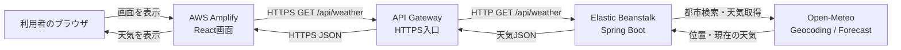
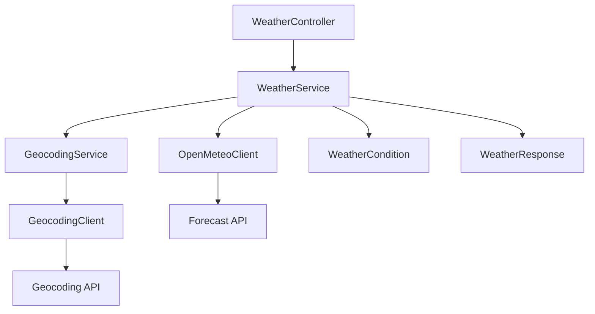
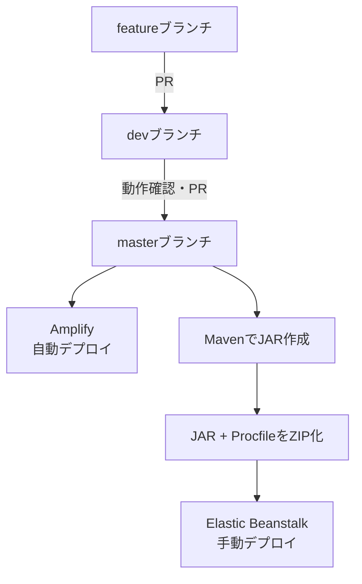

# Javaお天気アプリ 開発・構築まとめ

## 1. 開発環境構築

### 1.1 プロジェクト概要

本プロジェクトは、都市名を入力すると現在の天気を取得・表示するWebアプリケーションである。バックエンドはJavaとSpring Boot、フロントエンドはReactとTypeScriptで構築し、天気情報と都市検索にはOpen-MeteoのAPIを使用している。

リポジトリは、フロントエンドとバックエンドを同じGitリポジトリで管理する構成である。

```text
weather-app/
├── weather-backend/   Java / Spring Boot / Maven
├── weather-frontend/  React / TypeScript / Vite
└── README.md
```

### 1.2 使用技術

| 分類 | 使用技術 |
|---|---|
| 開発エディター | Visual Studio Code |
| バージョン管理 | Git / GitHub |
| バックエンド | Java 21 / Spring Boot / Maven Wrapper |
| フロントエンド | React / TypeScript / Vite / ESLint |
| 外部API | Open-Meteo Forecast API / Geocoding API |
| テスト・自動化 | JUnit / Maven Test / GitHub Actions |
| フロントエンド公開 | AWS Amplify Hosting |
| HTTPS API公開 | Amazon API Gateway HTTP API |
| バックエンド公開 | AWS Elastic Beanstalk |

### 1.3 初期構築とローカル起動

VS Codeで `weather-app` フォルダを開き、バックエンドとフロントエンドをそれぞれ起動する。

バックエンドは `weather-backend` で次を実行する。

```bash
./mvnw spring-boot:run
```

Windows PowerShellの場合は次のとおりである。

```powershell
.\mvnw.cmd spring-boot:run
```

バックエンドは、ローカル環境では既定で `http://localhost:8081` を使用する。

フロントエンドは `weather-frontend` で依存関係を導入し、開発サーバーを起動する。

```bash
npm install
npm run dev
```

Viteの開発画面は通常 `http://localhost:5173` で開く。`vite.config.ts` では `/api` を `http://localhost:8081` へ転送するプロキシを設定しているため、ローカル開発中のフロントエンドはバックエンドのポート番号を直接意識せずにAPIを呼び出せる。

```ts
server: {
  proxy: {
    '/api': {
      target: 'http://localhost:8081',
      changeOrigin: true,
    },
  },
}
```

### 1.4 動作確認コマンド

バックエンドでは、テストとパッケージ作成を次のコマンドで確認する。

```bash
./mvnw test
./mvnw clean package
```

フロントエンドでは、開発サーバー、静的解析、本番ビルドを次のコマンドで確認する。

```bash
npm run dev
npm run lint
npm run build
```

### 1.5 Gitとリリース運用

日常の開発は、最新の `dev` から機能ブランチを作成して進める。

```bash
git switch dev
git pull origin dev
git switch -c feature/機能名
```

変更後は対象ファイルをコミットし、GitHubへ送信する。

```bash
git add 変更したファイル
git commit -m "変更内容"
git push -u origin feature/機能名
```

開発の流れは次のとおりである。

```text
feature/xxx → dev向けプルリクエスト → devで確認
            → master向けプルリクエスト → AWS本番公開
```

GitHub Actionsによるテスト自動化と、GitHub Releasesを使ったバージョン公開も導入した。これまでに `v0.1.0`、`v0.1.1` のリリースを行っている。作業は原則として一度に1ファイルずつ確認しながら進める方針である。

## 2. バックエンド開発

### 2.1 バックエンドの役割

バックエンドは、フロントエンドから都市名を受け取り、都市の緯度・経度を検索した後、Open-Meteoから現在の天気を取得して、画面表示に必要な形式へ整えて返す。

主要なAPIは次のとおりである。

```http
GET /api/weather?city=Tokyo
GET /api/weather?city=London&country=United%20Kingdom
GET /api/weather/cities
```

`city` を省略した場合は `TOKYO` が使用される。`country` は同名都市を国名で絞り込むための任意項目である。

### 2.2 クラス構成

| レイヤー | 主なクラス | 役割 |
|---|---|---|
| Controller | `WeatherController` | HTTPリクエストの受付とレスポンス返却 |
| Service | `WeatherService` | 都市検索と天気取得処理の組み立て |
| Service | `GeocodingService` | 都市候補の検索・選択 |
| Client | `GeocodingClient` | Open-Meteo Geocoding APIとの通信 |
| Client | `OpenMeteoClient` | Open-Meteo Forecast APIとの通信 |
| Config | `WeatherApiProperties` | 外部APIのURL設定を保持 |
| Model | `WeatherResponse` など | 外部APIおよび画面向けデータ構造 |
| Enum | `WeatherCondition` | 天気コードと降水量から表示用天候を判定 |
| Exception | `GlobalExceptionHandler` | 例外をHTTPエラーへ統一変換 |

Controller、Service、Clientを分離し、コンストラクタインジェクションで依存関係を渡している。これにより、HTTP受付、業務ロジック、外部API通信を独立して変更・テストできる。

### 2.3 都市検索

`GeocodingService` は入力された都市名をGeocoding APIへ渡し、都市名、緯度、経度、都道府県・州、国、タイムゾーンを取得する。

日本語の都市名で候補が見つからない場合は、入力値の末尾へ `市`、`区`、`町`、`村` を付けて再検索する。国名が指定された場合はその国に一致する候補を選び、国名が指定されていない場合は日本の候補を優先する。条件に合う都市がない場合は `CityNotFoundException` を発生させる。

### 2.4 天気情報取得と表示用データ

都市検索で取得した緯度、経度、タイムゾーンを使い、Forecast APIから次の現在値を取得する。

```text
temperature_2m
weather_code
wind_speed_10m
precipitation
rain
showers
```

日本の都市では、Open-Meteoへのリクエストで気象庁MSMモデルを使用する。風速単位も画面表示と一致するよう設定した。

最終的なレスポンスには、処理状態、都市名、都道府県・州、国、気温、天気コード、日本語の天気説明、風速、対象都市のUTCオフセットを含む観測日時を格納する。

### 2.5 天候判定

`WeatherCondition` はOpen-MeteoのWMO天気コードを、晴れ、曇り、霧、霧雨、雨、雪、にわか雨、にわか雪、雷雨などの日本語表示へ変換する。

現在の天候は、天気コードだけでなく実際の降水量も使って補正する。判定順序は、雪系コード、にわか雨量、雨量または総降水量、最後に天気コードである。総降水量には雪も含まれるため、雪とにわか雪のコードを雨量判定より先に評価することで、雪を雨と誤判定しないようにした。

### 2.6 エラー処理

`GlobalExceptionHandler` でアプリ全体の例外を処理し、画面側で扱いやすいJSONへ変換する。

| 状況 | HTTPステータス | 内容 |
|---|---:|---|
| 不正な入力 | 400 | 入力内容に関するエラー |
| 都市が見つからない | 404 | 都市検索結果なし |
| 外部API通信失敗 | 502 | 天気情報の取得失敗 |
| レスポンス形式異常など | 500 | バックエンド内部エラー |

### 2.7 テスト

`WeatherConditionTest` では、天気コードと降水量による天候判定を検証した。特に、降水量がある場合の雨判定、にわか雨の優先、雪コードが雨へ誤変換されないことを確認している。

`WeatherServiceTest` では、都市検索結果と天気APIレスポンスを組み合わせて、期待する `WeatherResponse` が作られることを確認した。これらのテストはローカルのMavenコマンドとGitHub Actionsの両方で実行できる。

### 2.8 ローカルとAWSでの設定切り替え

`application.properties` では外部APIのURLと待受ポートを管理する。

```properties
spring.application.name=weather-backend
server.port=${PORT:8081}
weather.api.base-url=https://api.open-meteo.com/v1/forecast
weather.api.geocoding-url=https://geocoding-api.open-meteo.com/v1/search
```

`PORT` が未設定のローカル環境では8081を使用し、Elastic Beanstalkでは環境プロパティ `PORT=5000` を使用する。

公開したAmplifyフロントエンドからのアクセスを許可するため、`WeatherController` にはCORS設定を追加した。

```java
@CrossOrigin(origins = "${FRONTEND_URL:http://localhost:5173}")
@RestController
@RequestMapping("/api/weather")
public class WeatherController {
```

`FRONTEND_URL` が未設定ならローカルのVite URLを許可し、AWSではAmplifyの公開URLを環境プロパティとして設定する。

## 3. フロントエンド開発

### 3.1 フロントエンドの役割

フロントエンドは、利用者が都市名を入力するフォーム、検索結果、エラー表示を提供する。Reactの `useState` で天気データとエラーメッセージを管理し、`fetch` でバックエンドAPIを呼び出す。

主な構成は次のとおりである。

| ファイル | 役割 |
|---|---|
| `src/App.tsx` | 入力、API通信、天気結果、エラー表示 |
| `src/App.css` | アプリ画面の見た目 |
| `src/index.css` | 全体の基本スタイル |
| `src/main.tsx` | Reactアプリの起点 |
| `vite.config.ts` | Vite設定とローカルAPIプロキシ |

### 3.2 APIレスポンスの型

`App.tsx` では、バックエンドから受け取るデータを `WeatherData` 型として定義した。

```ts
type WeatherData = {
  status: string
  city: string
  prefecture: string
  country: string
  temperature: number
  weatherCode: number
  weatherDescription: string
  windSpeed: number
  time: string
}
```

バックエンドのレスポンス項目とTypeScriptの型を対応させることで、項目名や型の誤りをビルド時に検出しやすくしている。

### 3.3 都市検索とエラー表示

フォーム送信時に空欄を確認し、都市名をURLエンコードしてAPIへ送る。レスポンスが正常でない場合は、以前の検索結果を消して、利用者向けのメッセージを表示する。

```ts
const response = await fetch(
  `${apiBaseUrl}/api/weather?city=${encodeURIComponent(city.trim())}`,
)
```

```text
天気情報を取得できませんでした。都市名を確認してください。
```

### 3.4 検索結果画面

検索成功時には、都市名、天気アイコン、日本語の天気説明、現在の気温、風速を表示する。日本の都市は、都道府県・市区町村を組み合わせた表示にした。天気コードに応じて、晴れ、曇り、雨、雪、霧、雷雨などの絵文字アイコンを切り替える。

Open-Meteoへのクレジットと著作権表示も画面へ追加した。

### 3.5 API接続先の環境切り替え

ローカル開発とAWS本番で同じソースを使用できるよう、APIの基準URLをViteの環境変数から取得する。

```ts
const apiBaseUrl = import.meta.env.VITE_API_BASE_URL ?? ''
```

ローカルでは `VITE_API_BASE_URL` を設定せず、相対パス `/api/weather` をViteプロキシへ渡す。AWS Amplifyでは次の環境変数を設定し、HTTPSのAPI Gatewayへ接続する。

```text
VITE_API_BASE_URL=https://＜API ID＞.execute-api.ap-northeast-1.amazonaws.com
```

値の末尾に `/` や `/api/weather` は付けない。`App.tsx` 側で `/api/weather` を連結するためである。

## 4. AWS連携

### 4.1 AWS全体構成

AWSでは、フロントエンドをAmplify Hosting、バックエンドをElastic Beanstalkへ配置した。AmplifyはHTTPSで公開される一方、Elastic Beanstalkの初期ドメインはHTTPだったため、ブラウザのMixed Content制限を避ける目的でAPI GatewayをHTTPSの入口として追加した。

### 4.2 Elastic Beanstalkへのバックエンド公開

Elastic BeanstalkでJARを起動するため、`weather-backend` 直下へ拡張子なしの `Procfile` を追加した。

```text
web: java -jar application.jar
```

MavenでJARを作成し、デプロイ用フォルダへ `application.jar` という名前でコピーする。

```powershell
.\mvnw.cmd clean package

New-Item -ItemType Directory -Force deploy
Copy-Item .\target\weather-backend-＜バージョン＞.jar `
  .\deploy\application.jar -Force
Copy-Item .\Procfile .\deploy\Procfile -Force
Compress-Archive `
  -Path .\deploy\* `
  -DestinationPath .\weather-backend.zip `
  -Force
```

ZIP直下が次の構成になるようにする。`deploy` フォルダ自体をZIPへ含めない。

```text
application.jar
Procfile
```

Elastic BeanstalkではJava 21に対応するCorretto 21、64bit Amazon Linux 2023のJavaプラットフォームを選び、単一インスタンス環境へZIPをアップロードした。環境プロパティとして次を設定した。

```text
PORT=5000
FRONTEND_URL=https://＜Amplifyの公開ドメイン＞
```

`PORT=5000` はSpring BootがElastic Beanstalk上で待ち受けるポートであり、`FRONTEND_URL` はCORSで許可するフロントエンドのオリジンである。両者は別の目的を持つ。

デプロイ後は次のURLでJSONが返ることを確認した。

```text
http://＜Elastic Beanstalkドメイン＞/api/weather?city=Tokyo
```

### 4.3 API GatewayによるHTTPS化

API GatewayではHTTP APIを作成し、`GET /api/weather` ルートをElastic BeanstalkのHTTP統合へ接続した。ステージは `$default`、自動デプロイを有効にした。

最初はAPI Gatewayから `Not Found` が返った。これは `$default` ルートだけでは期待するルートと統合が一致していなかったため、明示的に次のルートを作成して統合を割り当てた。

```text
GET /api/weather
```

その後、API Gatewayの呼び出しでは `400 Bad Request` が返った。リクエストはElastic Beanstalkのnginxまで到達していたが、統合URLがバックエンドのAPIパスを含んでいなかったことが原因だった。HTTP統合を次の設定へ修正した。

```text
統合メソッド: GET
統合URL: http://＜Elastic Beanstalkドメイン＞/api/weather
```

統合URLにはクエリ文字列を含めない。API Gatewayが `city=Tokyo` を引き継ぐ。修正後、次のHTTPS URLから `200 OK` と天気JSONが返ることを確認した。

```text
https://＜API ID＞.execute-api.ap-northeast-1.amazonaws.com/api/weather?city=Tokyo
```

### 4.4 Amplify Hostingへのフロントエンド公開

Amplify HostingをGitHubリポジトリへ接続し、`master` ブランチを公開対象にした。リポジトリはモノレポなので、アプリのルートディレクトリを `weather-frontend` に設定した。

主なビルド処理は次のとおりである。

```yaml
preBuild:
  commands:
    - npm ci
build:
  commands:
    - npm run build
artifacts:
  baseDirectory: dist
  files:
    - '**/*'
```

Amplifyの環境変数には、API Gatewayの基準URLを登録した。

```text
VITE_API_BASE_URL=https://＜API ID＞.execute-api.ap-northeast-1.amazonaws.com
```

Amplifyの公開URLが確定した後、同じURLをElastic Beanstalkの `FRONTEND_URL` に設定した。Elastic Beanstalkの更新完了後、Amplifyの画面から都市を検索し、天気情報が正常に表示されることを確認した。これにより、HTTPS、CORS、フロントエンド、API Gateway、バックエンド、Open-Meteoの一連の接続が完成した。

### 4.5 今後のデプロイ方法

フロントエンドはAmplifyが `master` を監視しているため、`master` へのマージ後に自動でビルド・デプロイされる。

バックエンドは現在手動デプロイである。変更を `master` へ反映した後、Mavenで新しいJARを作成し、`application.jar` と `Procfile` を含むZIPを新しいアプリケーションバージョンとしてElastic Beanstalkへアップロードする。`v0.1.2` のように毎回異なるバージョンラベルを付けることで、問題発生時に以前のバージョンへ戻しやすくする。

| 環境 | フロントエンドのAPI接続先 | バックエンドの待受ポート | CORS許可元 |
|---|---|---:|---|
| ローカル | Viteプロキシ | 8081 | `http://localhost:5173` |
| AWS本番 | `VITE_API_BASE_URL` のAPI Gateway URL | 5000 | `FRONTEND_URL` のAmplify URL |

## 5. 全体モデル図

### 5.1 本番環境の通信モデル



### 5.2 バックエンド内部モデル



処理の中心は `WeatherService` である。最初に `GeocodingService` と `GeocodingClient` で都市を特定し、その位置情報を `OpenMeteoClient` へ渡して現在の天気を取得する。`WeatherCondition` が天気コードと降水量を日本語の天候へ変換し、最後に `WeatherResponse` としてControllerからフロントエンドへ返す。

### 5.3 開発・公開フロー



この構成により、通常の開発は `feature` と `dev` で安全に確認し、公開可能な変更だけを `master` へ反映できる。フロントエンドは自動公開、バックエンドはバージョンを管理しながら手動公開する運用となっている。
